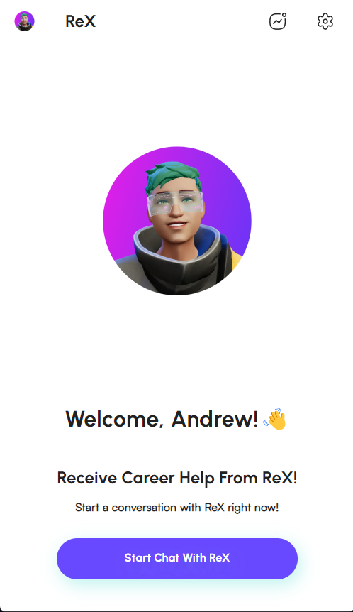
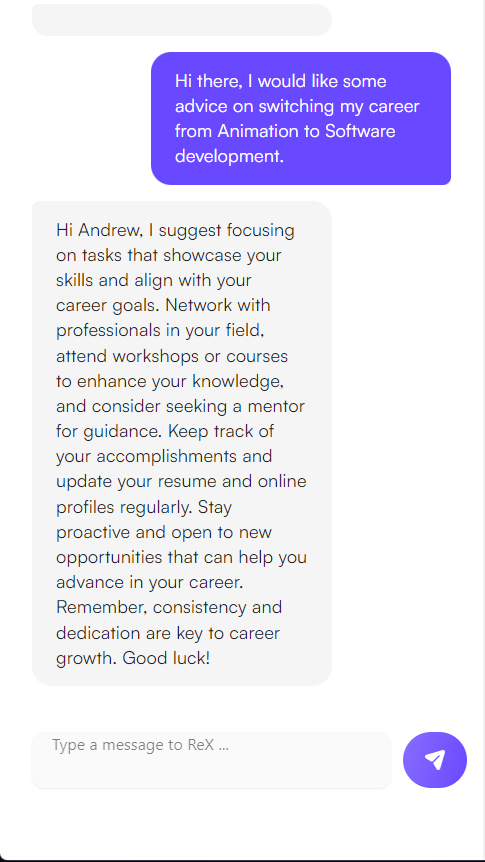
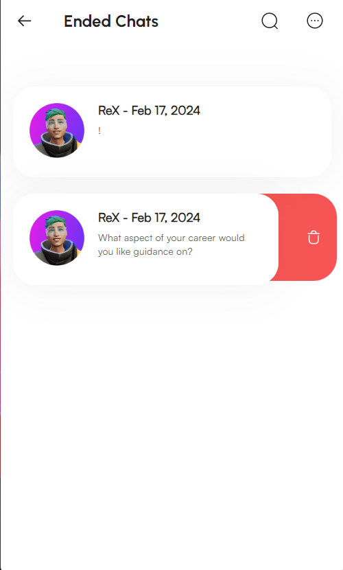
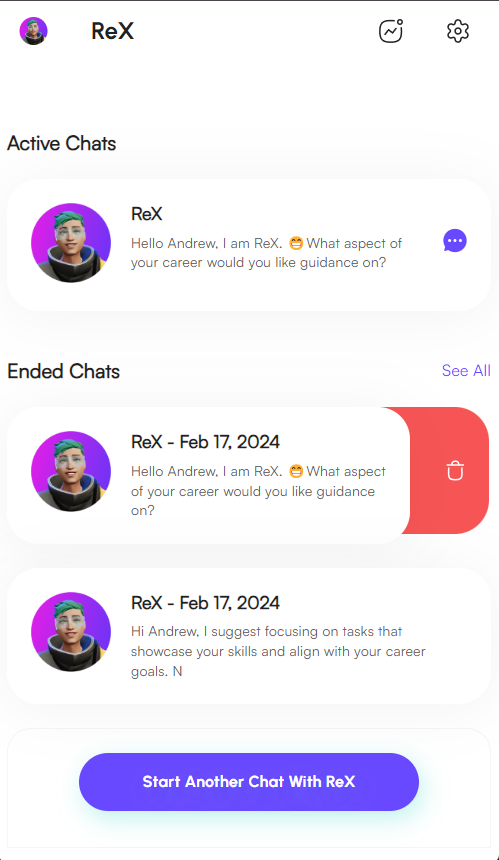
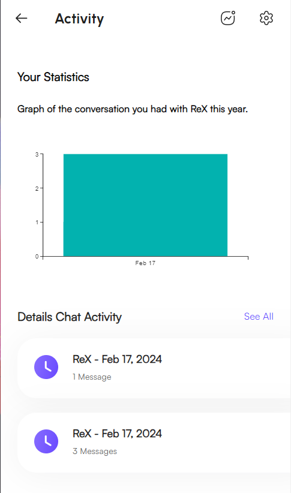

# CosmoChat UI

## Description
This is an app where the user named Andrew interacts with an openAI powered career advice assistant name ReX.

## Tools used
React.JS, Material UI, Framer Motion, Axios, Open AI. 

## Acknowledgement 
Special Thanks to my mentor Billy Bett for helping me get through my blockers and RadicalX CEO Talha Sabri for this opportunity. 

## Screen Shots

### Welcome Page

### Home Page

### Chat Window with openAI response

### Ended Chats List

### Chat Menu

### Delete Button on Home Page

### Activity Page

## About RadicalX

RadicalX is pioneering an immersive digital world designed specifically for Gen Z developers.# Cosmochat
